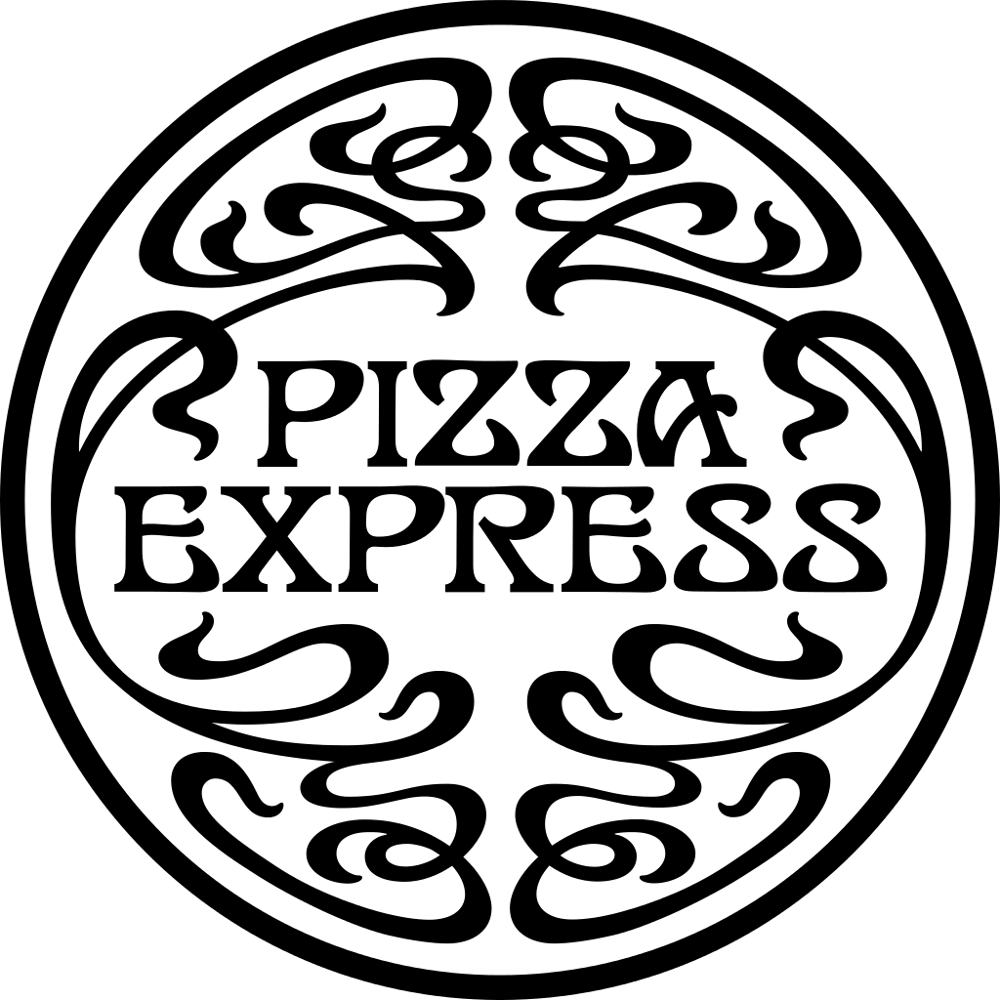

**Papa Johns.** First the very popular Papa John’s, consumed worldly, this pizza company has customers always coming back for more. The font used is very similar to Aachen bold, which is a slab serif font. It was designed by Colin Brignell in 1969. This typeface features sharp outlines, heavy strokes and stubby serifs. Often used in headlines, posters, signs and other display uses. Along with the enlarged letters in the middle and vibrant red and green colours Papa John’s font is clearly trying to make a statement. It’s bright, loud and has a strong looking font. The red, white and green also connotes it’s an Italian pizzeria. 

**Pizza Express.** They use the font Art Nouveau, which is encased in a circle filled with swirly over lapping lines. This font looks sophisticated, expensive and luxury. This is because of the fonts embellished stroke endings, diagonal and triangular character shapes, top and bottom-weighted stresses and very high and low waistlines. The font in the past has been used for paintings, sculptures and architecture, suggesting Pizza Express is trying to go for an art deco style look, honing in on the Italian art scene to sell a more sophisticated restaurant. Unlike Papa Johns or Pizza Hut their logo and font use connote they sell a higher-class pizza. 

**Pizza Hut**

The Pizza Hut logo uses a font called hot pizza which is a bespoke typeface created by Dennis Ludlow. It combines crisp modern lines with vintage tails and a swash, brush like stroke. It has a unique lower-case z and tight kerning. Like Papa john’s it’s bright and eye catching. It’s also less sophisticated than pizza express and connotes a warmer tone and old-fashioned feel with its messy outer edges and uneven slant. It gives off the vibe that they care less about their pizza quality and it’s okay to be messy while eating there. Something you buy when you’re in a rush or grabbing a quick slice. 

**Dominos** 

The Dominos font I’ve never really noticed before because it’s overshadowed by the clever domino logo design. In fact, all they use is Futura and the writing for Dominos itself is simply Futura bold with no tweaks only that the kerning is a bit tighter than regular. This is because when you build a great brand like their domino symbol, their customers don’t even look at the name because they already know. Just like McDonalds, they could put their iconic m on a box and audiences would easily guess what the brand is. Interestingly it has even got to the point where all they are putting on a pizza box is the blue and red background and one big circle in the middle because that’s all they need to tell the audience it’s good pizza. 

