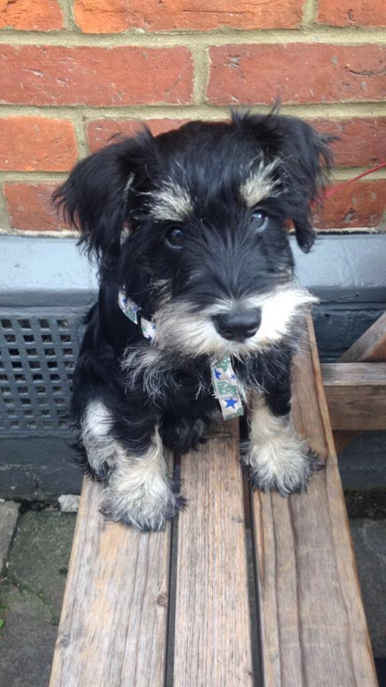

I am a second year student at Oxford Brookes studying Media Journalism and Publishing. 

I chose this degree because I find exploring language and meaning in media very intresting. Finding semiotics and different codes is something I'm very good at, and I think I will go into advertising in the future because building brand campaigns is something I'm fascinated by.

I love expressing my own thoughts through creative writing from time to time, as, I feel there is so much to comment on in the world today.

I am very comfortable around people and working in a team is one of my strengths as I'm currently the captian of the Brookes squash team for women. I would say I'm cheerful and see the positive things in a bad situation; I always try to save the day. I'm creative and I've made numerous short movies with my friends that have been shown to many audiences.

